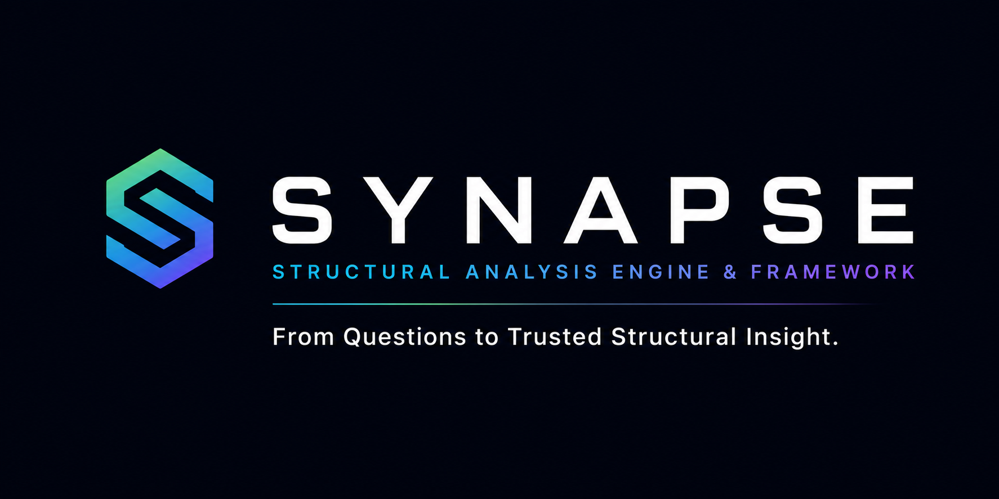

# SYNAPSE

<p align="center">
  
</p>

## Structural Analysis Engine & Framework

> From questions to trusted structural insight.

SYNAPSE is a general-purpose structural analysis framework for transforming topology into deterministic structural insight through formal mathematical models, compiler architecture, and reusable analysis engines.

The Dependency Algebra Compiler is the first structural compiler implemented within SYNAPSE and serves as the current reference implementation.

---

## Current Status

SYNAPSE has reached the **architecture-closure compiler milestone** for its first reference implementation. The current implementation includes:

- frozen schemas and fixtures
- frontend validator and normalizer
- canonical IR
- immutable typed compiler artifacts
- projection
- reachability
- predicate
- classification
- serialization boundary
- deterministic hash receipts
- thin CLI / argparse adapter
- installable console script packaging
- compatibility APIs

The implemented surface remains a structural compiler facade, analysis engine, canonical serialization utilities, and a thin CLI harness. It does not add GitHub Actions, ContinuityOS integration, a proof system, authority module, runtime hook, governance surface, policy surface, or external-state mutation surface.

---

## Vision

SYNAPSE is the long-term framework for converting structured questions about systems into deterministic structural analysis.

```text
Question
    ↓
Mathematical Model
    ↓
Formal Specification
    ↓
Compiler
    ↓
Structural Analysis Engine
    ↓
Applications
```

Dependency Algebra is the first implemented formalism within this framework. It defines the current reference path from topology contracts through structural compiler artifacts and deterministic analysis results.

---

## Repository Boundary

### This repository owns

- topology JSON contracts
- mathematical definitions
- parser / AST / IR contracts
- reachability semantics
- complement projection semantics
- dependency predicate semantics
- structural classification semantics
- deterministic compiler artifact schemas
- canonical fixtures
- conformance tests

### This repository does not own

- ContinuityOS governance validation
- execution eligibility
- runtime authorization
- proof generation
- authority propagation
- runtime policy
- mutation execution
- external-state mutation

`VALID`, `DEGRADED`, and `NULL` are **structural classifications only**. They are **not** governance decisions, execution authorizations, runtime proofs, or legitimacy results.

---

## Compiler Pipeline

```text
Raw Input
    ↓
Frontend Validation
    ↓
Canonical IR
    ↓
Projection
    ↓
Reachability
    ↓
Predicate
    ↓
AnalysisResult
    ↓
Serialization
    ↓
Hash Receipt
    ↓
CLI / Public API
```

Compiler stages exchange immutable typed artifacts. Serialization owns representation by converting typed artifacts into dictionaries and canonical JSON. Hashing owns artifact identity across serialized payload boundaries. Compatibility APIs cross the serialization boundary explicitly so public functions and CLI output remain dictionary- and JSON-shaped while the core compiler remains artifact-oriented.

---

## Long-Term SYNAPSE Architecture

```text
Topology
    ↓
Structural Compiler
    ↓
Structural Analysis Engine
    ↓
Visualization
    ↓
Optimization
    ↓
Simulation
```

The current repository implements the compiler layer of this architecture. Visualization, optimization, simulation, runtime policy, authority propagation, and external-state mutation remain outside this repository boundary.

---


## Installation

Install SYNAPSE from the repository root with modern Python packaging:

```bash
pip install .
```

After installation, the `synapse` console script and importable library surfaces are available.

## SYNAPSE CLI

Issue #57 owns the active CLI behavior surface. Issue #79 owns packaging and release readiness for the installed command-line and library surfaces. Issue #83 owns foundation conformance and remains outside this packaging boundary.

The stable installed command shape is:

```bash
synapse compile --input fixtures/basic.json --output out/artifact.json
```

The repository-local module invocation remains available for development:

```bash
python -m dependency_algebra.cli compile --input fixtures/basic.json --output out/artifact.json
```

The CLI compiles canonical topology JSON into the deterministic structural evidence artifact and writes no success output to stdout or stderr. Diagnostics are canonical machine-readable JSON on stderr.

Stable exit codes:

| Code | Meaning |
| ---: | --- |
| 0 | Success |
| 1 | Input, schema, or validation failure |
| 2 | Compiler semantic failure |
| 3 | Artifact emission failure |
| 4 | Unexpected runtime failure |

The CLI never mutates input files and does not perform cross-repository conformance, packaging, release, publishing, or GitHub Action integration.

## Library Usage

Use the compatibility `synapse` facade for the SYNAPSE-branded import surface:

```python
from synapse import compile_topology, __version__

artifact = compile_topology(open("fixtures/basic.json", "rb").read(), source_id="basic")
print(__version__)
print(artifact["artifact_hash"])
```

Existing Dependency Algebra imports remain supported:

```python
from dependency_algebra import compile_artifact, __version__

artifact = compile_artifact(open("fixtures/basic.json", "rb").read(), source_id="basic")
```

The top-level `synapse` module is a thin compatibility facade over `dependency_algebra`; it does not duplicate compiler logic or add runtime, governance, policy, authority, execution-eligibility, or cross-repository conformance behavior.

## Validation

Validation is intentionally layered:

- JSON Schema structural validation
- deterministic semantic validation
- conformance suite

Run the conformance suite:

```bash
python -m unittest discover -s tests -p '*_tests.py'
```

---

## Contracts

All contracts are structural-analysis contracts only. They do not introduce governance, proof, authority, execution, policy, runtime, or mutation behavior.

### `AST_IR_CONTRACT.md`

- **Purpose:** Defines the compiler architecture boundary between source topology and normalized analysis representation.
- **Boundary:** AST remains source-faithful and diagnostic-oriented; IR is canonical, normalized, and analysis-ready. Normalized IR equality is based on canonical UTF-8 JSON bytes with sorted object keys, compact separators, canonical set ordering, and no trailing newline. `normalized_ir_hash` is SHA-256 over that canonical normalized IR hash payload.
- **Current status:** Frozen planning contract from Issue #10.

### `REACHABILITY_CONTRACT.md`

- **Purpose:** Defines canonical `Reach(W)` semantics.
- **Boundary:** Reachability is a per-workload, directed-edge, path-existence contract over normalized IR. It defines deterministic multi-root handling, unreachable results, cycle termination, self-loop handling, disconnected-component behavior, result shape, ordering, and hash boundaries.
- **Current status:** Frozen planning contract from Issue #11.

### `COMPILER_FRONTEND_CONTRACT.md`

- **Purpose:** Closes pre-implementation frontend planning gaps.
- **Boundary:** Defines parser diagnostic taxonomy, AST construction rules, normalization design rules, diagnostic ordering, diagnostic schema boundaries, and diagnostics-only conformance vectors.
- **Current status:** Contract-only frontend specification.

### `COMPLEMENT_PROJECTION_CONTRACT.md`

- **Purpose:** Defines canonical `¬S` complement projection semantics.
- **Boundary:** Complement projection is a deterministic, structural-only transformation from normalized IR plus a component candidate set to projected normalized IR. It removes candidate components and incident edges, preserves unaffected graph structure and workload definitions, defines `projected_ir_hash`, and emits structural diagnostics only.
- **Current status:** Frozen planning contract from Issue #12.
